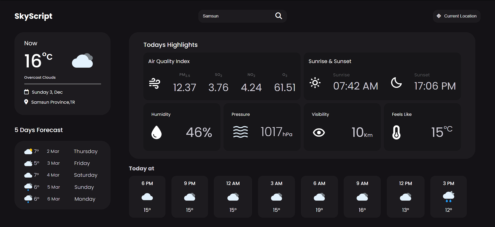

# SkyScript Weather App

SkyScript is a simple and elegant weather application that provides current weather conditions, 5-day forecast, and various weather-related information for a given city. It offers a clean user interface with a responsive design, making it easy to use on both desktop and mobile devices.

## Table of Contents
- [Introduction](#skyscript-weather-app)
- [Features](#features)
- [Screenshots](#screenshots)
- [Installation](#installation)
- [Usage](#usage)
- [Technologies Used](#technologies-used)

## Features
- Real-time weather information for a specified city.
- 5-day weather forecast, including temperature and weather icon.
- Air quality index with details on PM2.5, SO2, NO2, and O3 levels.
- Sunrise and sunset times.
- Additional details like humidity, pressure, visibility, and feels-like temperature.
- Weather widgets for specific time intervals within the day.

## Screenshots


## Installation
1. Clone the repository.
    ```bash
    git clone https://github.com/Abdirashid-dv/SkyScript.git
    ```
2. Open the `index.html` file in your preferred web browser.

## Usage
- Enter the name of the city in the search bar and press Enter or click the search button.
- Click on the "Current Location" button to get weather information based on your geolocation.
- View detailed weather information, including temperature, air quality, and more.
- Explore the 5-day forecast to plan ahead.

## Technologies Used
- HTML
- CSS
- JavaScript
- [OpenWeatherMap API](https://openweathermap.org/api) for weather data


